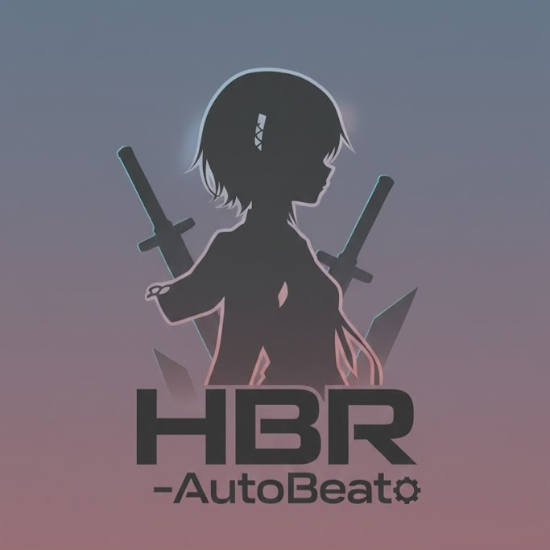
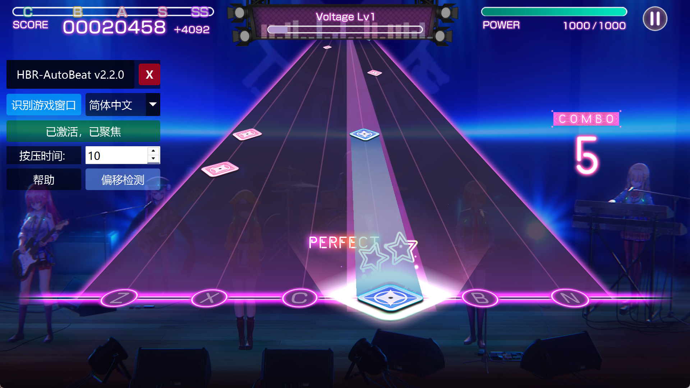
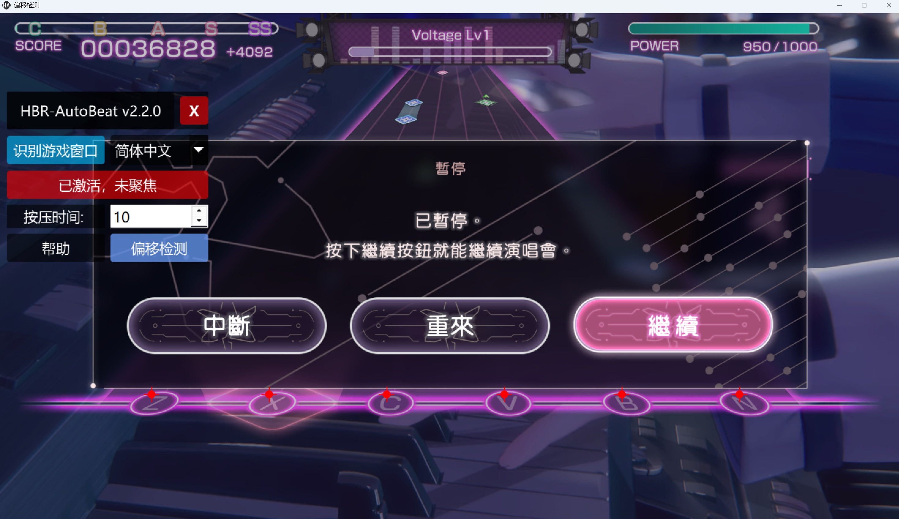



  

# HBR-AutoBeat

  

言語：日本語  他の言語： [English](README.md)  [简体中文](README_zh-CN.md)

Heaven Burns Red (HBR) 向けの AutoBeat 補助ツールです。

## クイックスタート

リリース版実行ファイルをダウンロードして実行してください：

- https://github.com/yujianke100/HBR-AutoBeat/releases/latest

開発者向け（詳細は `docs/HOWTO.md`）

## 機能

- 自動打歌機能

## 使用説明

### 自動打歌

このスクリプトは報酬取得のみを目的としています。高難度ロジックは完全には実装されておらず、スコア上位を取られないことを保証します。

自分専用のスクリプトで、互換性は考慮していません。戦略はシンプルでピクセル色の変化ベース。残血エフェクトが判定点に影響する場合は失敗します。ハード SS ランク取得まで最適化しており、スコア上位は目指さず、報酬回収が目的です。

#### 使用手順

- ゲームを起動し、解像度を 1080P (1920  1080) に設定します。
- ソフトウェアを開き、「自動打歌」をクリックして打歌ウィンドウを開きます。
- 打歌設定をデフォルトにリセットし、背景を「なし」に、キーサイズを 80% に調整し、「同時押しラインを表示」を無効にします。
- 「ゲームウィンドウを検出」ボタンでゲームウィンドウに合わせます。ゲームウィンドウが移動した場合は再度検出してください。
- ゲームが「コンサート開始」画面にあることを確認します。アクティベートボタンをクリック後、ゲームに戻ります。アクティベートと フォーカスボタンが緑に変わったら、「コンサート開始」をクリックして自動打歌を開始します。
- 連続打歌に関する設定は自動打歌ビューで利用できます。

#### トラブルシューティング

- キー入力遅延: キーサイズを 80% に調整してみてください。
- アプリケーションがクラッシュする: Steam クライアントを使用しており、ウィンドウタイトルが `HeavenBurnsRed` であることを確認してください。
- 連続タップまたはパフォーマンス問題: システムスケーリングを 100% に設定してください（2K ディスプレイでは 125% が動作する場合があります）。 マルチモニター環境では、ゲームウィンドウを必ずメインモニターに配置してください。また、座標認識の精度を保つため、ゲームウィンドウが他のウィンドウに隠れないようにしてください。「オフセット検出」を使用して、認識位置が正しくないかどうかをテストできます。正しい認識結果は以下の通りです：

  

- 完全ミス: スクリプトが実行中、キー設定が正しく、ゲームウィンドウが完全に表示されていることを確認し、必要に応じて管理者権限で実行してみてください。

ディスカッション：

- NGA フォーラム（最新）：https://bbs.nga.cn/read.php?tid=43140018&_ff=510381

ビデオと設定ガイド：

- 例示ビデオを視聴：https://www.bilibili.com/video/BV1ePH7eSEwJ（セットアップとキーサイズ設定）
